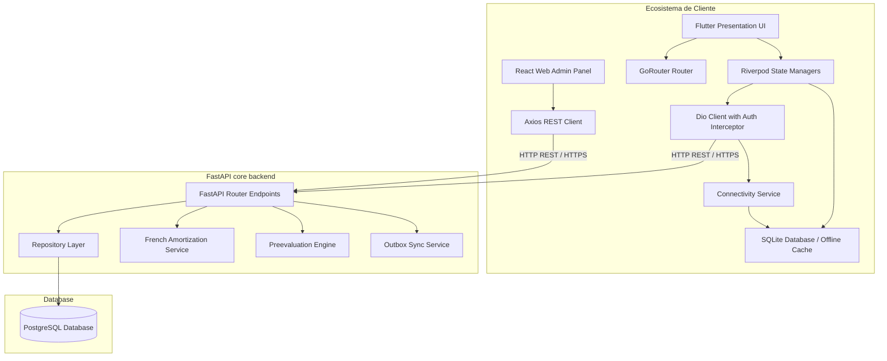
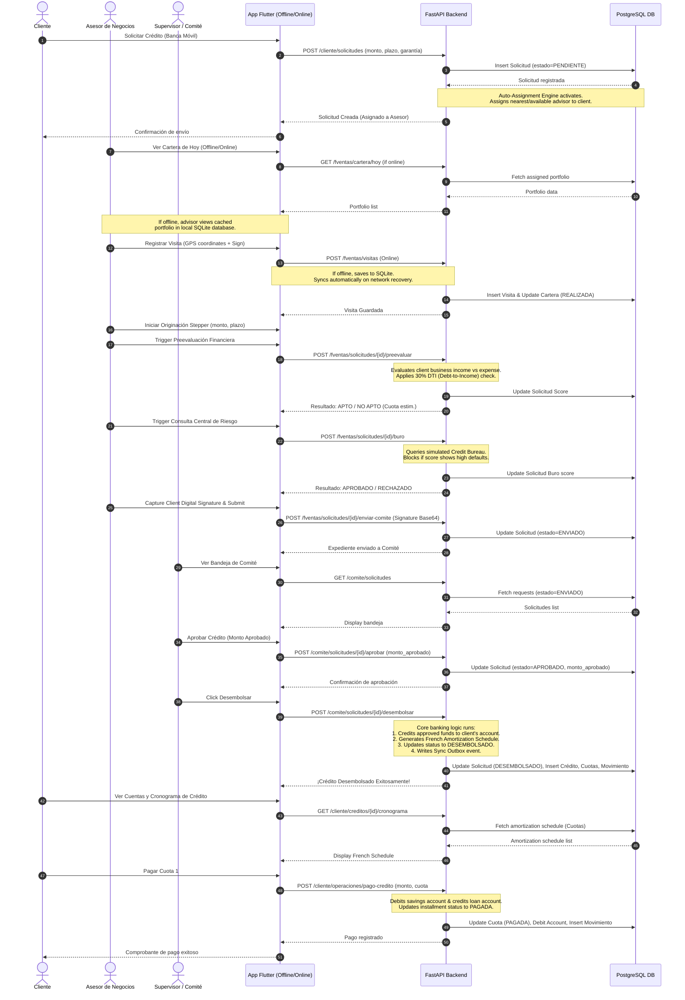

# BCP Mobile Core 360 - Architecture Documentation

This document describes the high-level architecture, component communication, end-to-end data flows, and database relationships of the **BCP Mobile Core 360** ecosystem.

---

## 1. High-Level Component Architecture

The ecosystem consists of a multi-role Flutter application, an offline-first cache engine, a REST API built with FastAPI, and a database layer powered by PostgreSQL.



---

## 2. End-to-End Credit Pipeline Sequence Flow

This sequence diagram illustrates the entire pipeline, from a credit request to automated advisor assignment, pre-evaluation, central risk scoring, committee review, disbursement, amortization schedule creation, and client payment.



---

## 3. Database Entity-Relationship Diagram (ERD)

This section maps the relational design of the database. Primary keys are UUIDs, and foreign keys strictly enforce cascading rules.

```mermaid
erDiagram
    usuarios {
        uuid id_usuario PK
        string documento UK
        string codigo_empleado UK
        string correo UK
        string password_hash
        string rol
        string estado
        int intentos_fallidos
        timestamp bloqueado_hasta
        timestamp created_at
        timestamp updated_at
    }

    clientes {
        uuid id_cliente PK
        uuid id_usuario FK
        string documento UK
        string nombres
        string apellidos
        string telefono
        string correo
        string direccion
        string distrito
        string provincia
        string departamento
        date fecha_nacimiento
        string estado_civil
        string ocupacion
        string tipo_cliente
        timestamp created_at
    }

    negocios {
        uuid id_negocio PK
        uuid id_cliente FK
        string ruc
        string nombre_comercial
        string actividad_economica
        string direccion
        decimal ingreso_mensual
        decimal gasto_mensual
        timestamp created_at
    }

    asesores {
        uuid id_asesor PK
        uuid id_usuario FK
        string codigo_empleado UK
        string nombres
        string apellidos
        string agencia
        string estado
        timestamp created_at
    }

    cuentas_ahorro {
        uuid id_cuenta PK
        uuid id_cliente FK
        string numero_cuenta UK
        string cci UK
        string moneda
        decimal saldo_disponible
        decimal saldo_contable
        string estado
        timestamp created_at
    }

    tarjetas_debito {
        uuid id_tarjeta PK
        uuid id_cuenta FK
        string numero_enmascarado
        string token_seguridad
        string estado
        string fecha_vencimiento
        timestamp created_at
    }

    productos_credito {
        uuid id_producto_credito PK
        string codigo UK
        string nombre
        string tipo
        decimal tea_con_seguro
        decimal tea_sin_seguro
        decimal monto_minimo
        decimal monto_maximo
        int plazo_minimo
        int plazo_maximo
        string moneda
        string estado
        timestamp created_at
    }

    solicitudes_credito {
        uuid id_solicitud PK
        uuid id_cliente FK
        uuid id_negocio FK
        uuid id_producto_credito FK
        uuid id_asesor_asignado FK
        string numero_expediente UK
        decimal monto_solicitado
        decimal monto_aprobado
        int plazo_meses
        boolean con_seguro_desgravamen
        string garantia
        string destino_credito
        string estado
        string resultado_preevaluacion
        int puntaje_preevaluacion
        string resultado_buro
        string calificacion_buro
        string firma_cliente_base64
        decimal lat_captura
        decimal lng_captura
        string observacion_rechazo
        string condicion_aprobacion
        timestamp created_at
        timestamp updated_at
    }

    cartera_diaria {
        uuid id_cartera PK
        uuid id_asesor FK
        uuid id_cliente FK
        uuid id_solicitud FK
        timestamp fecha_asignacion
        string tipo_gestion
        string prioridad
        int score_prioridad
        string estado_visita
        string resultado_visita
        string observacion_visita
        decimal lat_visita
        decimal lng_visita
        timestamp timestamp_visita
        timestamp created_at
    }

    creditos {
        uuid id_credito PK
        uuid id_solicitud FK
        uuid id_cliente FK
        uuid id_cuenta_desembolso FK
        string numero_credito UK
        decimal monto_desembolsado
        decimal saldo_capital
        decimal tea
        int plazo_meses
        decimal cuota_mensual
        string estado
        timestamp created_at
        timestamp updated_at
    }

    cronograma_pagos {
        uuid id_cuota PK
        uuid id_credito FK
        int numero_cuota
        date fecha_pago
        decimal monto_cuota
        decimal amortizacion
        decimal interes
        decimal seguro_desgravamen
        decimal saldo_remanente
        string estado
        timestamp fecha_pagado
        timestamp created_at
    }

    movimientos_cuenta {
        uuid id_movimiento PK
        uuid id_cuenta FK
        string tipo_operacion
        decimal monto
        string descripcion
        timestamp fecha_movimiento
    }

    sync_outbox {
        uuid id_sync PK
        string tipo_evento
        string id_registro_referencia
        string payload
        string estado
        int reintentos
        timestamp created_at
        timestamp updated_at
    }

    sync_logs {
        uuid id_log PK
        timestamp fecha_sincronizacion
        string origen_datos
        boolean exito
        string mensaje_respuesta
    }

    usuarios ||--o| clientes : "tiene"
    usuarios ||--o| asesores : "tiene"
    clientes ||--o{ negocios : "posee"
    clientes ||--o{ cuentas_ahorro : "posee"
    cuentas_ahorro ||--o{ tarjetas_debito : "vincula"
    clientes ||--o{ solicitudes_credito : "solicita"
    negocios ||--o{ solicitudes_credito : "sustenta"
    productos_credito ||--o{ solicitudes_credito : "aplica"
    asesores ||--o{ solicitudes_credito : "evalúa"
    asesores ||--o{ cartera_diaria : "gestiona"
    clientes ||--o{ cartera_diaria : "visita"
    solicitudes_credito ||--o{ cartera_diaria : "origina"
    solicitudes_credito ||--o| creditos : "desembolsa"
    creditos ||--o{ cronograma_pagos : "genera"
    cuentas_ahorro ||--o{ movimientos_cuenta : "registra"
